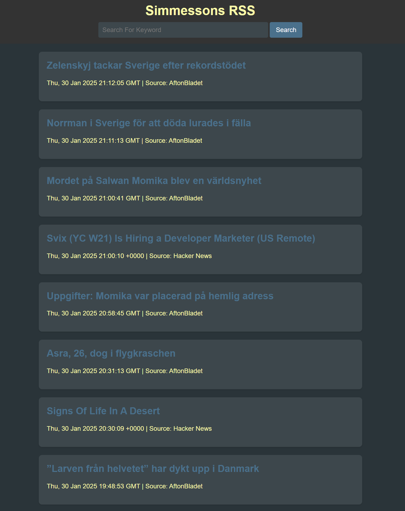

# Self Hosted RSS reader
A small RSS reader python application for a personal, self-hosted feed.

- run locally with ./scripts/run_dev.sh
- Push to your docker registry with ./scripts/push_docker_container.sh

My deployment is availible at: https://rss.simmesson.com

